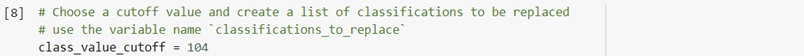

# deep-learning-challenge
## Overview of the Analysis

* The purpose of the analysis is to select applicants for funding with the best chance of success in their ventures.

* Results: 
    * Data Preprocessing
        * The target(s) for your model
            * "IS_SUCCESSFUL".
        * The features for your model
            * APPLICATION_TYPE—Alphabet Soup application type
            * AFFILIATION—Affiliated sector of industry
            * CLASSIFICATION—Government organization classification
            * USE_CASE—Use case for funding
            * ORGANIZATION—Organization type
            * STATUS—Active status
            * INCOME_AMT—Income classification
            * SPECIAL_CONSIDERATIONS—Special considerations for application
            * ASK_AMT—Funding amount requested
        * Variables there were removed from the input data because they are neither targets nor features.
            * EIN and NAME—Identification columns
    
    * Compiling, Training, and Evaluating the Model
        * I start with 80 and 30 neurons and 2 layers, because this was the attribute on the starter code.
        * I was not able to achieve the target model performance
        * Steps I took in attempts to increase model performance
            * Decreasing the number of values for each bin for both APPLICATION_TYPE and CLASSIFICATION
            
                
                

            * Drop more columns and increase the number of values for each bin for both APPLICATION_TYPE and CLASSIFICATION
            
                
                
                

            * Drop more columns, increase the number of values for each bin for both APPLICATION_TYPE and CLASSIFICATION and add more neurons to a hidden layer.

                
                
                
                

* Summary:
    * Unfortunately, with the updates I made I was not successful in achieving a target predictive accuracy higher than 75%.

***
***

## Module 21 Challenge
### Preprocess the Data
---
* Create a dataframe containing the charity_data.csv data , and identify the target and feature variables in the dataset
* Dropped the EIN and NAME columns
* Determine the number of unique values in each column
* For columns with more than 10 unique values, determine the number of data points for each unique value
* Create a new value called Other that contains rare categorical variables
* Create a feature array, X, and a target array, y by using the preprocessed data
* Split the preprocessed data into training and testing datasets
* Scale the data by using a StandardScaler that has been fitted to the training data

### Compile, Train and Evaluate the Model
---
* Create a neural network model with a defined number of input features and nodes for each layer
* Create hidden layers and an output layer with appropriate activation functions
* Check the structure of the model
* Compile and train the model
* Evaluate the model using the test data to determine the loss and accuracy
* Export your results to an HDF5 file named AlphabetSoupCharity.h5

### Optimize the Model
---
* Repeat the preprocessing steps in a new Jupyter notebook
* Create a new neural network model, implementing at least 3 model optimization methods
* Save and export your results to an HDF5 file named AlphabetSoupCharity_Optimization.h5

### Write a Report on the Neural Network Mode
---
* Write an analysis that includes a title and multiple sections, labeled with headers and subheaders 
* Format images in the report so that they display correction
* Explain the purpose of the analysis
* Answer all 6 questions in the results section
* Summarize the overall results of your model
* Describe how you could use a different model to solve the same problem, and explain why you would use that model
